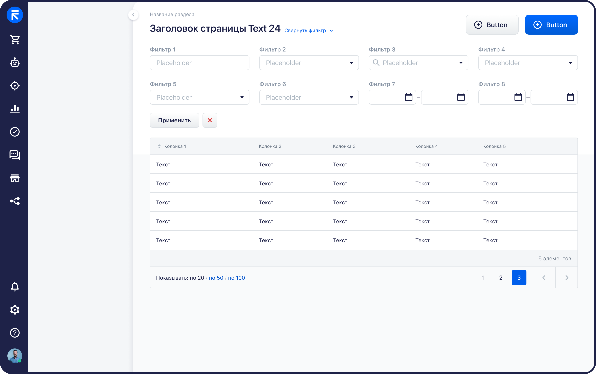
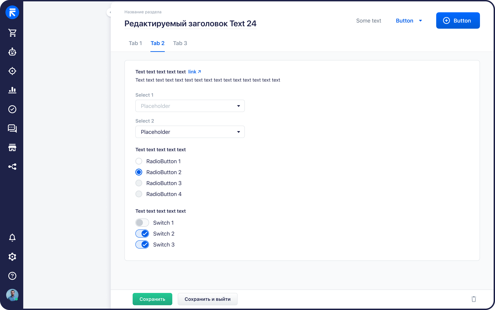
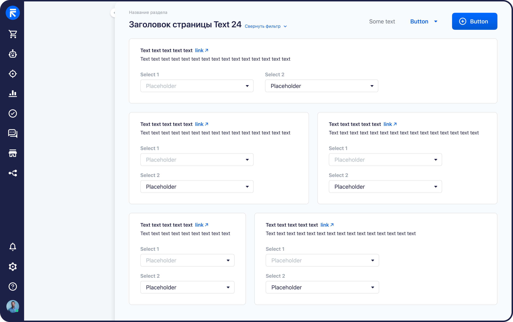
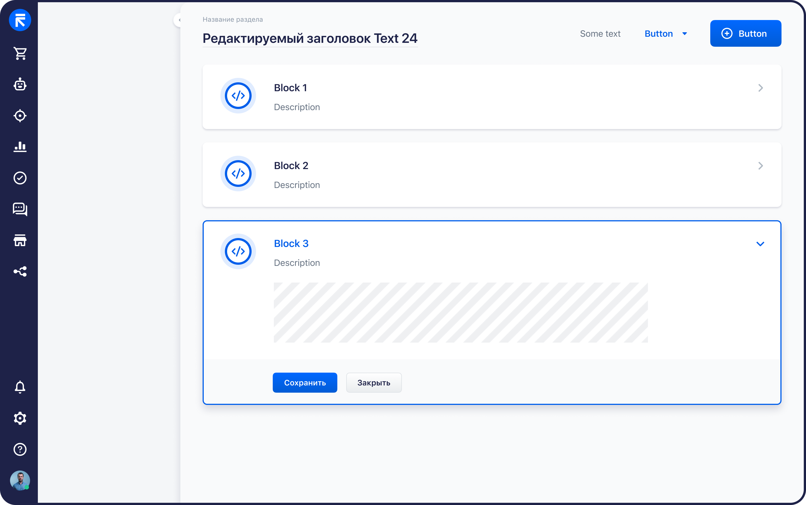
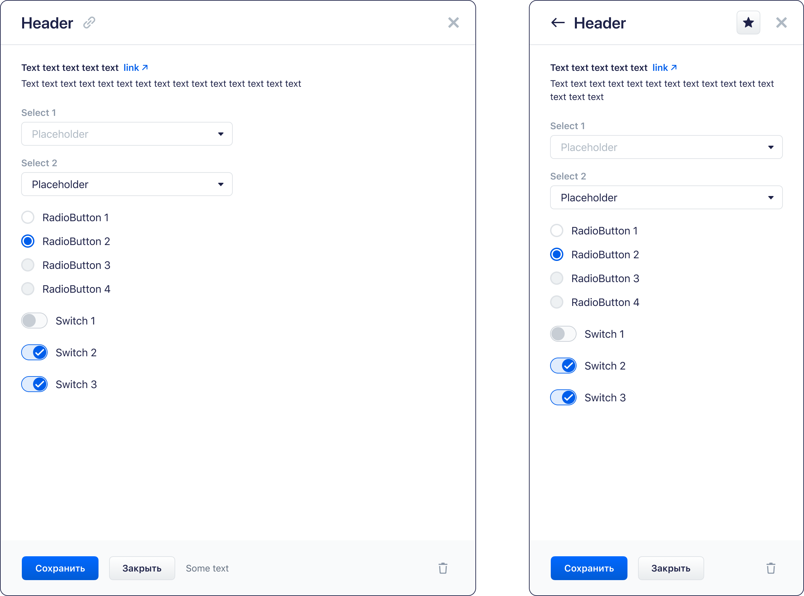
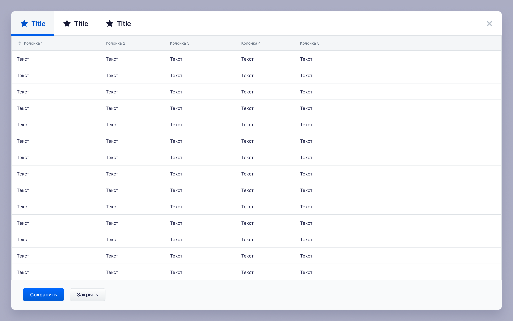

# Agent Design Guidelines

These guidelines describe page construction rules for AI assistants that generate RetailCRM
extension screens with `@retailcrm/embed-ui-v1-components`.

## How Agents Should Use This File

- Use this file after `README.md`, `AGENTS.md`, `AI.md`, and the relevant component profiles.
- Treat it as page-composition guidance, not as a replacement for component API docs.
- Prefer public components from `@retailcrm/embed-ui-v1-components/remote`.
- Use Storybook and YAML profiles for exact component props and examples.
- Do not invent new chrome for pages, forms, tables, tabs, buttons, modals, or sidebars when a documented component exists.

## Shared Page Rules

- Page title uses the large accent text style: `Text large Accent 24`.
- Page-level actions sit to the right of the title.
- A page can have only one `Default Primary` button and one `Success Primary` button.
- Additional page actions can use secondary or tertiary variants in unlimited quantity when the task needs them.
- When a group has multiple buttons, the primary action should represent the main flow. Secondary actions should support or cancel that flow.
- Components inside pages and blocks should be spaced by values divisible by 4px: `4`, `8`, `12`, `16`, `20`, `24`, `28`, `32`, and so on.
- Content blocks commonly use 32px left, right, and bottom padding and 24px top padding.

## Entity List Page

Use this pattern for separate pages that list entities and allow filtering or creating a new entity.



Examples from the design:

- order list;
- customer list;
- mailing list;
- task list.

Expected structure:

- `UiPageHeader` with a page title.
- One or more 48px page buttons on the right side of the header.
- If there are multiple header buttons, one should be primary and the rest can be secondary or tertiary.
- The main primary button usually creates a new entity for the list.
- Filters above the table, built from controls such as select, textbox, and combobox-like selection components.
- Filter controls should run in rows of roughly 4-5 fields, then wrap to the next row.
- Filters can be collapsible.
- Filter apply action uses a default secondary 36px text button.
- Filter reset action uses a danger secondary 36px icon button.
- The entity data is shown in a table.
- The table may scroll and may support export.

Recommended components:

- `UiPageHeader`
- `UiButton`
- `UiField`
- `UiTextbox`
- `UiSelect`
- `UiTable`
- `UiTableColumn`
- `UiTableSorter`
- `UiTableFooterSection`
- `UiTableFooterButton`

Canonical table footer pattern:

```vue
<script lang="ts" setup>
import IconChevronLeft from '@retailcrm/embed-ui-v1-components/assets/sprites/arrows/chevron-left.svg'
import IconChevronRight from '@retailcrm/embed-ui-v1-components/assets/sprites/arrows/chevron-right.svg'
import {
  UiTable,
  UiTableColumn,
  UiTableFooterButton,
  UiTableFooterSection,
} from '@retailcrm/embed-ui-v1-components/remote'
</script>

<template>
  <UiTable
    class="entity-list-table"
    bordered
    :rows="rows"
    row-key="id"
  >
    <UiTableColumn label="Название">
      <template #cell="{ row }">
        {{ row.title }}
      </template>
    </UiTableColumn>

    <template #footer-summary="{ rowsCount }">
      <span>{{ rowsCount }} элементов</span>
    </template>

    <template #footer-page-size>
      <UiTableFooterSection class="entity-list-table__page-size">
        <span class="entity-list-table__footer-caption">Показывать:</span>
        <UiTableFooterButton class="entity-list-table__footer-button entity-list-table__footer-button_passive">
          по 20
        </UiTableFooterButton>
        <span class="entity-list-table__footer-delimiter">/</span>
        <UiTableFooterButton class="entity-list-table__footer-button">
          по 50
        </UiTableFooterButton>
        <span class="entity-list-table__footer-delimiter">/</span>
        <UiTableFooterButton class="entity-list-table__footer-button">
          по 100
        </UiTableFooterButton>
      </UiTableFooterSection>
    </template>

    <template #footer-pagination>
      <UiTableFooterSection class="entity-list-table__pagination-section">
        <div class="entity-list-table__pagination">
          <UiTableFooterButton class="entity-list-table__pagination-button">
            1
          </UiTableFooterButton>
          <UiTableFooterButton class="entity-list-table__pagination-button">
            2
          </UiTableFooterButton>
          <UiTableFooterButton class="entity-list-table__pagination-button entity-list-table__pagination-button_current">
            3
          </UiTableFooterButton>
          <span class="entity-list-table__pagination-divider" />
          <UiTableFooterButton
            aria-label="Предыдущая страница"
            class="entity-list-table__pagination-arrow"
          >
            <IconChevronLeft
              aria-hidden="true"
              class="entity-list-table__pagination-arrow-icon"
            />
          </UiTableFooterButton>
          <span class="entity-list-table__pagination-divider" />
          <UiTableFooterButton
            aria-label="Следующая страница"
            class="entity-list-table__pagination-arrow"
          >
            <IconChevronRight
              aria-hidden="true"
              class="entity-list-table__pagination-arrow-icon"
            />
          </UiTableFooterButton>
        </div>
      </UiTableFooterSection>
    </template>
  </UiTable>
</template>
```

Footer CSS contract:

```css
.entity-list-table {
  --ui-v1-table-cell-padding-x: 12px;
  --ui-v1-table-cell-padding-y: 12px;
  --ui-v1-table-padding-start: 16px;
  --ui-v1-table-padding-end: 16px;
  --ui-v1-table-rounding: 4px;
  --ui-v1-table-head-cell-padding-block-start: 14px;
  --ui-v1-table-head-cell-padding-block-end: 14px;
  --ui-v1-table-body-cell-padding-block-start: 15px;
  --ui-v1-table-body-cell-padding-block-end: 15px;
}

.entity-list-table .ui-v1-table__head-cell {
  height: 42px;
}

.entity-list-table .ui-v1-table__footer-meta {
  min-height: 40px;
  font-weight: 400;
}

.entity-list-table .ui-v1-table__footer-controls {
  min-height: 52px;
  background: #f9fafb;
}

.entity-list-table .ui-v1-table__footer-section {
  font-size: 14px;
  line-height: 20px;
}

.entity-list-table__page-size,
.entity-list-table__pagination-section {
  color: #1e2248;
}

.entity-list-table__footer-caption {
  display: inline-block;
  margin-right: 4px;
  vertical-align: baseline;
  line-height: inherit;
}

.entity-list-table__footer-button {
  color: #005eeb;
}

.entity-list-table__footer-button_passive {
  color: #1e2248;
}

.entity-list-table__footer-delimiter {
  display: inline-block;
  padding: 0 5px;
  color: #8a96a6;
  vertical-align: baseline;
  line-height: inherit;
}

.entity-list-table .ui-v1-table__footer-side > .entity-list-table__pagination-section {
  padding-block: 8px;
}

.entity-list-table__pagination {
  display: flex;
  align-items: center;
  gap: 8px;
  height: 36px;
}

.entity-list-table__pagination-button,
.entity-list-table__pagination-arrow {
  width: 36px;
  height: 36px;
  border-radius: 4px;
}

.entity-list-table .ui-v1-table__footer-button.entity-list-table__pagination-button {
  color: #1e2248;
  font-size: 14px;
  line-height: 20px;
}

.entity-list-table .ui-v1-table__footer-button.entity-list-table__pagination-button_current {
  color: #fff;
  background: #005eeb;
}

.entity-list-table .ui-v1-table__footer-button.entity-list-table__pagination-arrow {
  color: #afb9c3;
}

.entity-list-table__pagination-arrow-icon {
  display: block;
  width: 24px;
  height: 24px;
}

.entity-list-table__pagination-divider {
  width: 1px;
  height: 52px;
  margin-block: -8px;
  background: #dee2e6;
}
```

Use `UiTableFooterSection` and `UiTableFooterButton` for table footer pagination. Do not replace them
with regular `UiButton`. Use chevron icon assets for arrow controls, not text glyphs. Keep footer
styling scoped to a local table root class, and override the internal footer button class together
with the local class when changing pagination text, active page, or arrow colors.

## Card Or Settings Page

Use this pattern for settings pages or entity cards made mostly from forms.



Examples from the design:

- tracked event page;
- sending limit settings;
- email template settings;
- trigger page.

Expected structure:

- `UiPageHeader` with a page title.
- The title can be editable via an inline-edit pattern when the product flow requires it.
- One or more 48px header buttons on the right.
- Header actions can be accompanied by text information or status labels.
- Optional top tabs.
- Main content sits on a white content surface.
- The content can include text, buttons, fields, checkboxes, radio groups, switches, and other form controls.
- A bottom save panel is optional.

Recommended components:

- `UiPageHeader`
- `UiButton`
- `UiField`
- `UiTextbox`
- `UiSelect`
- `UiCheckbox`
- `UiRadio`
- `UiRadioSwitch`
- `UiSwitch`
- `UiTabGroup`
- `UiTab`
- `UiTag`

## Multi-Column Page

Use this pattern when an entity card or detail page contains several semantic blocks that should be visible in parallel.



Examples from the design:

- order page;
- customer page;
- product view page.

Layout rules:

- Content is placed on surfaces.
- The most common surface spans the full screen width.
- Semantic blocks can be arranged vertically and horizontally.
- Distance between blocks is 24px.
- Allowed width distributions are:
  - `100%`;
  - `50% / 50%`;
  - `30% / 70%`.

Keep the visual hierarchy operational and dense. Do not turn internal CRM work screens into marketing-style layouts.

## Collapse-Block Page

Use this pattern for settings split into semantic groups.



Examples from the design:

- product editing;
- mailing editing;
- Double Opt-In settings.

Expected structure:

- Multiple collapsible blocks with their own content and local actions.
- If the page contains only collapse blocks, the white page surface is not needed.
- If every collapse block has its own save action, the bottom save panel is not needed.
- Collapse blocks can contain text, buttons, fields, controls, and small tables.

Avoid inside collapse blocks:

- complex tables;
- nested collapse blocks;
- two-column content split across separate surfaces.

Recommended components:

- `UiCollapse`
- `UiCollapseBox`
- `UiCollapseGroup`
- `UiButton`
- `UiField`
- `UiTable` only for small, simple tables

## Modal Sidebar

Use this pattern for a small contextual form, local additional information, or a compact entity card with a limited number of fields and settings.



Examples from the design:

- task card;
- notifications;
- new ticket;
- scenario step editing.

Size rules:

- Sidebar can use two widths: `720px` and `416px`.

Expected structure:

- Fixed header at the top with title and close button.
- Header can also contain extra text, icon, button, or tag.
- If a sidebar opens from another sidebar, show a back arrow to return to the previous sidebar.
- Fixed footer at the bottom.
- Footer usually contains save, cancel/close, and delete actions.
- Footer can also contain a copy button or auxiliary text.
- Content can be flexible, but should stay compact.
- Small tables can be placed in sidebars.

Avoid in sidebars:

- collapse blocks;
- two-column content on separate surfaces;
- bulky or complex interfaces.

For bulky flows, use a full page or modal window instead.

Recommended components:

- `UiModalSidebar`
- `UiButton`
- `UiTag`
- `UiField`
- `UiTextbox`
- `UiSelect`
- `UiTable` only for small, simple tables

## Modal Window

Use this pattern for large contextual tables or additional local settings when a sidebar is not enough.



Examples from the design:

- adding products to an order;
- marking products in an order;
- viewing an email from the communication list;
- merging duplicates in the database cleanliness section.

Size rules:

- Modal can use two sizes:
  - `960px`;
  - full screen with side margins.

Expected structure:

- Fixed header at the top with title and close button.
- Header can include extra text, icon, button, or tag.
- Fixed footer at the bottom.
- Footer usually contains save, cancel/close, and delete actions.
- Footer can also contain a copy button or auxiliary text.
- Content can be flexible; tables are a common modal use case.
- If a modal contains a table, the table stretches across the modal width.
- If a modal is split into sections, use large tabs instead of a regular modal header.

Spacing rules:

- Left, right, and bottom margins: 32px.
- Top margin: 24px.

Recommended components:

- `UiModalWindow`
- `UiButton`
- `UiTabGroup`
- `UiTab`
- `UiTable`
- `UiTableColumn`
- `UiTableFooterSection`

## Quick Decision Guide

- Need a searchable, filterable registry: use an entity list page.
- Need to edit an entity or settings form: use a card/settings page.
- Need several semantic blocks visible together: use a multi-column page.
- Need grouped settings with independent sections: use a collapse-block page.
- Need a small contextual form or compact entity card: use a modal sidebar.
- Need a large local workflow, auxiliary table, or dense settings flow: use a modal window.

When uncertain between sidebar and modal, choose sidebar only if the flow is compact. If the content needs wide tables, several sections, or complex controls, choose modal or full page.
